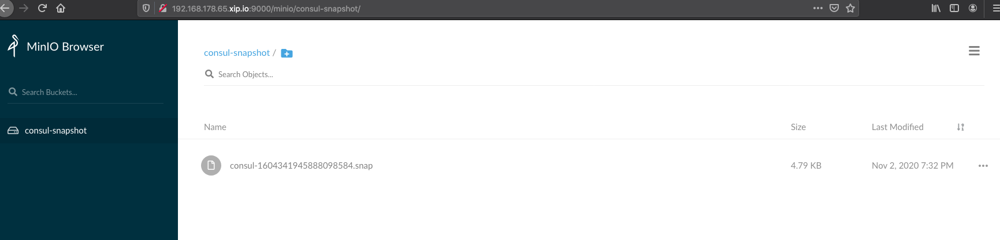

# consul-minio-snapshot
Consul snapshot agent on Minio

# Assumption
- you need to use consul snapshot agent to export you consul snapshot on minio

# Pre-requirements

- [consul enterprise](https://www.consul.io/docs/enterprise) 
- [minio](https://min.io/)
- [vagrant](https://www.vagrantup.com/)

# How to consume

this repository will create 4 vagrant boxes - consul cluster (3 boxes), 1 minio server

```bash
git clone git@github.com:hc-use-cases/consul-minio-snapshot.git
cd consul-minio-snapshot
```

please configure the ip addresses as your local network

```ruby
(1..3).each do |i|
  config.vm.define vm_name="consul#{i}" do |node|
    node.vm.box = "apopa/bionic64"
    node.vm.hostname = vm_name
    node.vm.network "public_network", ip: "192.168.178.#{30+i}"
    node.vm.provision "shell", path: "scripts/consul_server.sh"
  end
end

config.vm.define vm_name="minio" do |node|
  node.vm.box = "apopa/bionic64"
  node.vm.hostname = vm_name
  node.vm.provision "shell", path: "scripts/minio.sh"
  node.vm.network "public_network", ip: "192.168.178.65"
end
```

once you configure the network in `Vagrantfile`

```bash
vagrant up
```

the resule will be like this

```bash
$ vagrant status
Current machine states:

consul1                   running (virtualbox)
consul2                   running (virtualbox)
consul3                   running (virtualbox)
minio                     running (virtualbox)
```

login to consul1 and add the enterprise license, where `consul.hclic` is license file

```bash
vagrant ssh consul1
cd /vagrant/
consul license put @consul.hclic
```

on the same box you can run the command to create the snapshot

```bash
consul snapshot agent -config-file=/etc/consul.d/snap-conf.json
```

as result you'll have snapshot created on `minio` server



as well as in cli on `minio` box

login

```bash
vagrant ssh minio
```

check the directory

```bash
vagrant@minio:~$ ls -l /data/consul-snapshot/
total 8
-rw-r--r-- 1 vagrant vagrant 4902 Nov  2 18:32 consul-1604341945888098584.snap
```
